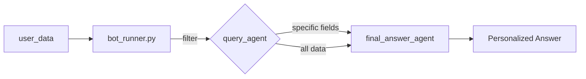

#  Qaddemly AI Assistant Bot

Qaddemly AI Assistant is a multi-agent chatbot system that intelligently handles user questions in a job platform. It utilizes classification, task analysis, RAG (Retrieval-Augmented Generation), and LLM reasoning to provide helpful answers based on system features, user data, or documentation.

---


```mermaid
%%{init: {'theme': 'neutral', 'fontFamily': 'Arial', 'gantt': {'barHeight': 20}}}%%
flowchart TD
    A[User Request] --> B[main.py\nFastAPI Endpoint]
    B --> C{bot_runner.py\nOrchestrator}
    
    C -->|GENERAL| D[rag_system.py\nRAG Answer]
    C -->|SPECIFIC| E[Agent Pipeline]
    
    E --> F[classifier_agent\nGENERAL/SPECIFIC]
    E --> G[task_agent\nFeature Detection]
    E --> H[query_agent\nData Needs]
    E --> I[final_answer_agent\nResponse Gen]
    
    H -->|Data Needed| J[Extract from\nuser_data]
    H -->|NOTNEEDED_DATA| K[Use Full\nuser_data]
    
    J --> I
    K --> I
    
    subgraph Agents[agents.py]
    F
    G
    H
    I
    end
    
    subgraph Tasks[tasks.py]
    T1[build_classifier_task]
    T2[build_task_classifier_task]
    T3[build_query_task]
    T4[build_final_answer_task]
    end
    
    F <--> T1
    G <--> T2
    H <--> T3
    I <--> T4
    
    style A fill:#2ecc71,stroke:#27ae60
    style B fill:#3498db,stroke:#2980b9
    style C fill:#9b59b6,stroke:#8e44ad
    style D fill:#e74c3c,stroke:#c0392b
    style E fill:#f39c12,stroke:#d35400
    style Agents fill:#1abc9c,stroke:#16a085
    style Tasks fill:#34495e,stroke:#2c3e50
```

## Detailed Flow Explanation

1. **User Request**:
   ```mermaid
   flowchart LR
   U[User] -->|POST /qaddemly-bot\nquestion + user_data| M[main.py]
   ```

2. **Orchestration** (`bot_runner.py`):
   ```mermaid
   flowchart TD
   B[bot_runner] --> C{Question Type?}
   C -->|GENERAL| D[RAG System]
   C -->|SPECIFIC| E[Initialize Agents]
   ```

3. **Agent Pipeline**:
   ```mermaid
   flowchart LR
   F[Classifier] --> G[Task Detector] --> H[Data Query] --> I[Answer Generator]
   ```

4. **Data Handling**:
   ```mermaid
   flowchart LR
   H -->|Needs Data| J[user_data\nfiltering]
   H -->|No Data| K[user_data\nfull]
   ```

5. **Response Generation**:
   ```mermaid
   flowchart LR
   I -->|Formatted Answer| M[main.py] --> U[User]
   ```

## Key Components

| Component | File | Responsibility |
|-----------|------|----------------|
| API Gateway | main.py | HTTP interface, request routing |
| Orchestrator | bot_runner.py | Workflow management |
| RAG System | rag_system.py | General knowledge answers |
| Classifier Agent | agents.py | Question type detection |
| Task Agent | agents.py | Feature identification |
| Query Agent | agents.py | Data requirements analysis |
| Answer Agent | agents.py | Response generation |
| Task Builders | tasks.py | Agent-specific prompt engineering |

## Data Flow



## Features

- **Intent Classification** (General vs Specific)
- **Feature Task Detection** (e.g., Recommendation, Resume Builder)
- **RAG System** for general queries using LangChain + FAISS
- **User-Aware Answering** using personalized profile data
- **Multi-step Reasoning** via [CrewAI](https://www.crewai.com/)
- **LLM-Powered Agents** using `Groq` API + `llama3`

---

## Technologies Used

| Stack         | Description                      |
| ------------- | -------------------------------- |
| **FastAPI**   | API backend                      |
| **CrewAI**    | Agent orchestration              |
| **LangChain** | RAG system with FAISS embeddings |
| **FAISS**     | Vector search database           |
| **Groq**      | LLM provider (LLaMA3)            |
| **Pydantic**  | Data validation                  |
| **dotenv**    | Environment variable loader      |

---

## Getting Started

### 1. Clone the repo

```bash
git clone https://github.com/your-username/qaddemly-bot.git
cd qaddemly-bot
```

### 2. Install dependencies

```bash
pip install -r requirements.txt
```

### 3. Create `.env` file

```env
GROQ_API_KEY=your_groq_api_key
AGENTOPS_API_KEY=your_agentops_key  # Optional
```

### 4. Run the FastAPI server

```bash
uvicorn main:app --reload
```

### 5. (Optional) Expose using ngrok

```bash
ngrok http 8000
```

---

## API Usage

### Endpoint

`POST /qaddemly-bot`

### Request Body

```json
{
  "question": "What job roles am I best suited for based on my profile?",
  "user_type": "candidate",
  "user_data": {
    "first_name": "Abdo",
    "skills": ["Node.js", "Spring boot", "Java"],
    "experiences": [...],
    ...
  }
}
```

### Response

```json
{
  "classification": "SPECIFIC",
  "task_type": "OTHER",
  "needed_data": "USER_PROFILE",
  "answer": "Based on your profile, here are roles that suit you best..."
}
```

---

## 📁 Folder Structure

```qaddemly-bot/
├── main.py                  # FastAPI endpoint
├── bot_runner.py            # Core logic to run multi-agent workflow
├── rag_system.py            # Retrieval-Augmented Generation system
├── agents.py                # CrewAI agents definition
├── tasks.py                 # Tasks per agent
├── data/
│   └── QA.json              # Static FAQ data for RAG
├── QA_faiss_index/          # Saved FAISS index
├── .env                     # Secrets (not committed)
├── requirements.txt         # Python dependencies
└── README.md
```

---

## 📌 Notes

- The `QA.json` file is used for **general queries**. If missing or modified, the FAISS index is automatically rebuilt.
- Add new question-answer pairs in `QA.json` to enhance general responses.
- CrewAI allows for sequential task execution between agents.

---
