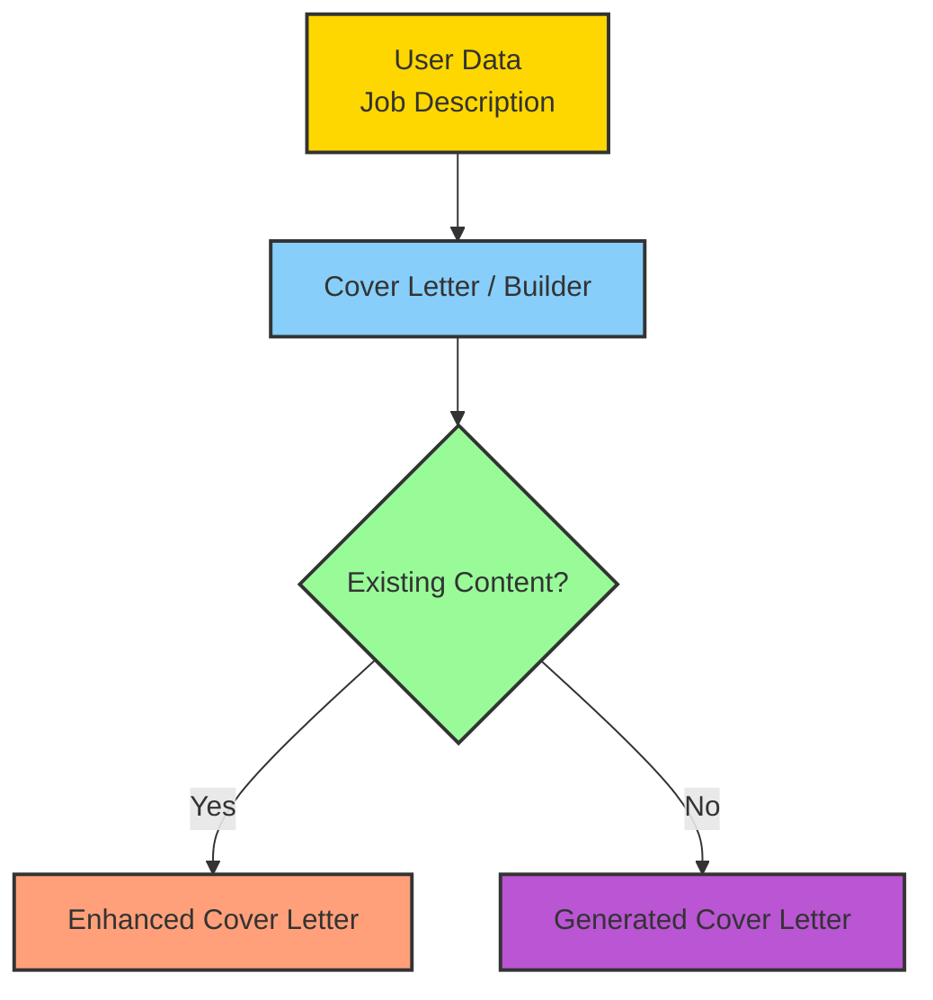

```mermaid
graph TD
    %% Set white background by adding a transparent rectangle
    Z[ ]:::transparent
    
    A["User Data<br>Job Description"] --> B["Cover Letter / Builder"]
    B --> C{"Existing Content?"}
    C -->|Yes| D["Enhanced Cover Letter"]
    C -->|No| E["Generated Cover Letter"]
    
    classDef transparent fill:#ffffff,stroke:#ffffff,color:#ffffff;
    
    style A fill:#FFD700,stroke:#333,stroke-width:2px,color:#333
    style B fill:#87CEFA,stroke:#333,stroke-width:2px,color:#333
    style C fill:#98FB98,stroke:#333,stroke-width:2px,color:#333
    style D fill:#FFA07A,stroke:#333,stroke-width:2px,color:#333
    style E fill:#BA55D3,stroke:#333,stroke-width:2px,color:#333
    
    linkStyle default stroke:#333
```