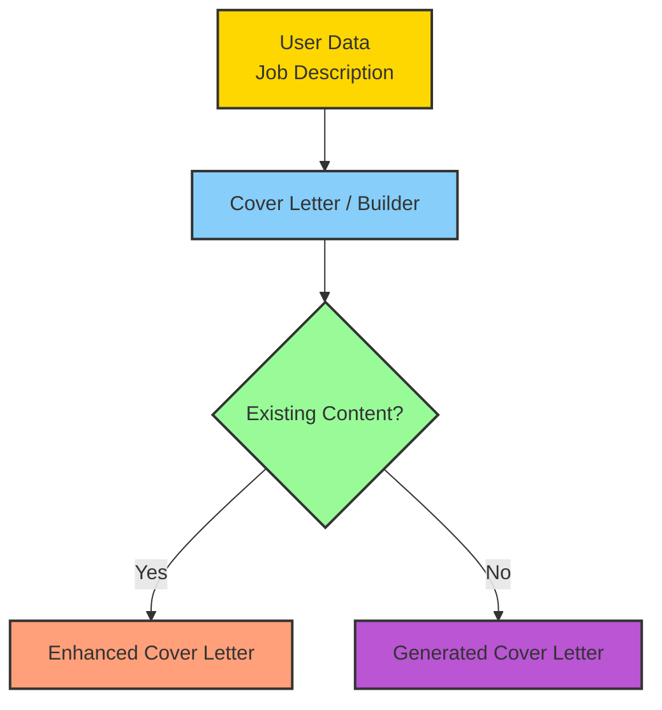
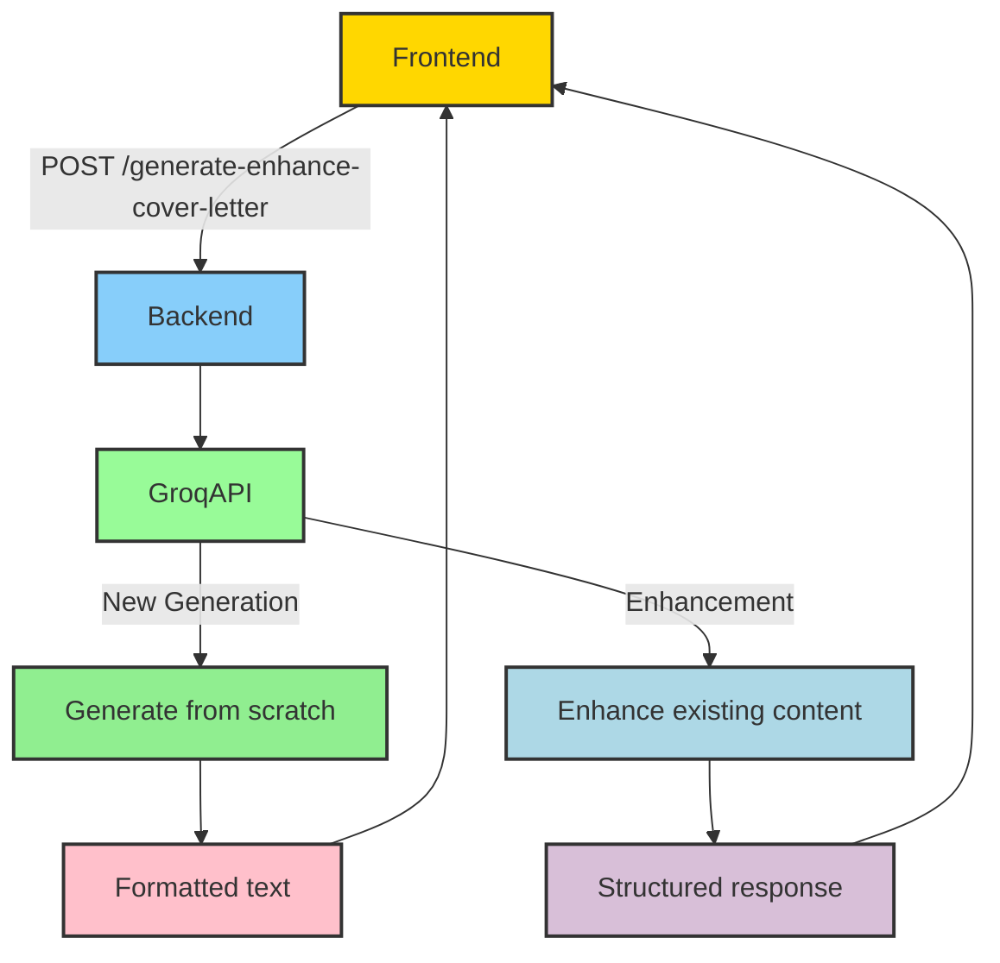

system overview 

```mermaid
graph TD
    %% Set white background by adding a transparent rectangle
    Z[ ]:::transparent
    
    A["User Data<br>Job Description"] --> B["Cover Letter / Builder"]
    B --> C{"Existing Content?"}
    C -->|Yes| D["Enhanced Cover Letter"]
    C -->|No| E["Generated Cover Letter"]
    
    classDef transparent fill:#ffffff,stroke:#ffffff,color:#ffffff;
    
    style A fill:#FFD700,stroke:#333,stroke-width:2px,color:#333
    style B fill:#87CEFA,stroke:#333,stroke-width:2px,color:#333
    style C fill:#98FB98,stroke:#333,stroke-width:2px,color:#333
    style D fill:#FFA07A,stroke:#333,stroke-width:2px,color:#333
    style E fill:#BA55D3,stroke:#333,stroke-width:2px,color:#333
    
    linkStyle default stroke:#333
```
system Architectue 

```mermaid
graph TD
    %% Frontend Section
    F[Frontend]:::frontend
    F -->|"POST /generate-enhance-cover-letter"| B[Backend]:::backend
    
    %% Backend to GroqAPI paths
    B --> G[GroqAPI]:::groq
    G -->|"New Generation"| N["Generate from scratch"]:::green
    G -->|"Enhancement"| E["Enhance existing content"]:::blue
    
    %% Response paths
    N --> R1["Formatted text"]:::pink
    E --> R2["Structured response"]:::purple
    R1 --> F
    R2 --> F
    
    %% Style definitions
    classDef frontend fill:#FFD700,stroke:#333,stroke-width:2px,color:#333;
    classDef backend fill:#87CEFA,stroke:#333,stroke-width:2px,color:#333;
    classDef groq fill:#98FB98,stroke:#333,stroke-width:2px,color:#333;
    classDef green fill:#90EE90,stroke:#333,stroke-width:2px,color:#333;
    classDef blue fill:#ADD8E6,stroke:#333,stroke-width:2px,color:#333;
    classDef pink fill:#FFC0CB,stroke:#333,stroke-width:2px,color:#333;
    classDef purple fill:#D8BFD8,stroke:#333,stroke-width:2px,color:#333;
    
    %% Hidden white background node
    Z[ ]:::whitebg
    classDef whitebg fill:#ffffff,stroke:#ffffff,color:#ffffff;
```

